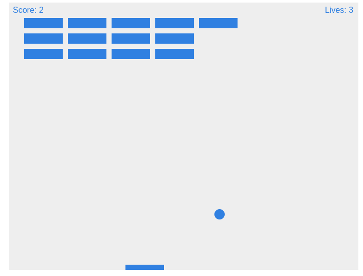

# Breakoutish

> In this repo you will find a very basic version of the game breakout. Feel free to clone the repo and try it out, let me know what you think and any sugestions you might have. 
Note: This is a project for fun so implementations will be long winded.



## Built With

- Javascript

## Getting Started

To get a local copy up and running follow these simple example steps.

### Install

Clone the project by typing ```https://github.com/jurgen1c/Breakout-Clone.git```

### Prerequisites

Vscode with Liveserver

 or

NPM

### Usage

Use Liveserver extension or run with npm

## Author

👤 **Jurgen Clausen Gutierrez**

- Github: [@jurgen1c](https://github.com/jurgen1c)
- LinkedIn: [jurgen-clausen](https://www.linkedin.com/in/jurgen-clausen-2740061a9/)

## 🤝 Contributing

Contributions, issues and feature requests are welcome!

Feel free to check the [issues page](issues/).

## Show your support

Give a ⭐️ if you like this project!

## Acknowledgments

Mozilla

## 📝 License

This project is [MIT](lic.url) licensed.
